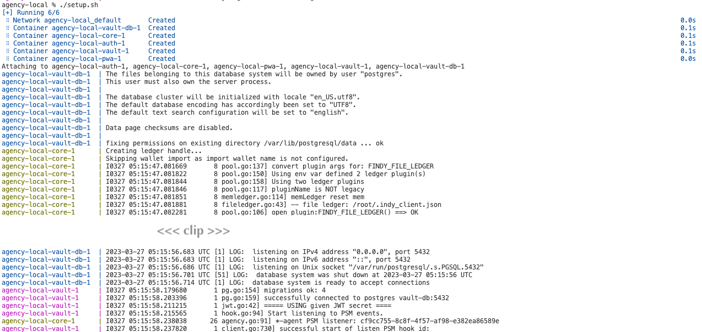

# Running Agency Locally

## Start script

Open a terminal window to this folder
and set up the agency to your localhost using an installation script:

```shell
./setup.sh
```

The script starts the needed agency services in Docker containers.

You should see output similar to following once agency has started:



## Shutting down

Open a terminal window to this folder and run

```shell
docker-compose down
```

If you wish to remove all generated data, delete the folder `.data`:

```shell
rm -rf .data
```
