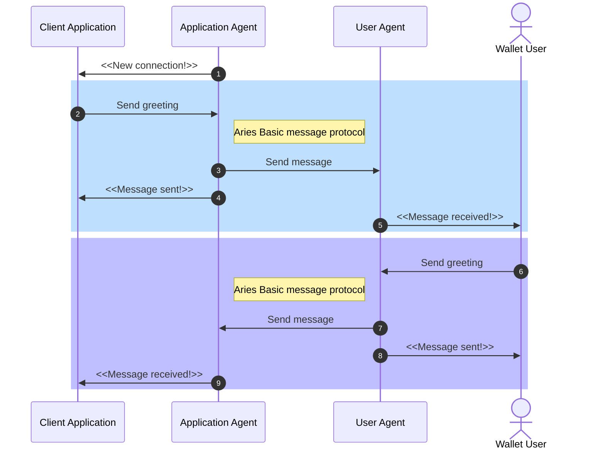
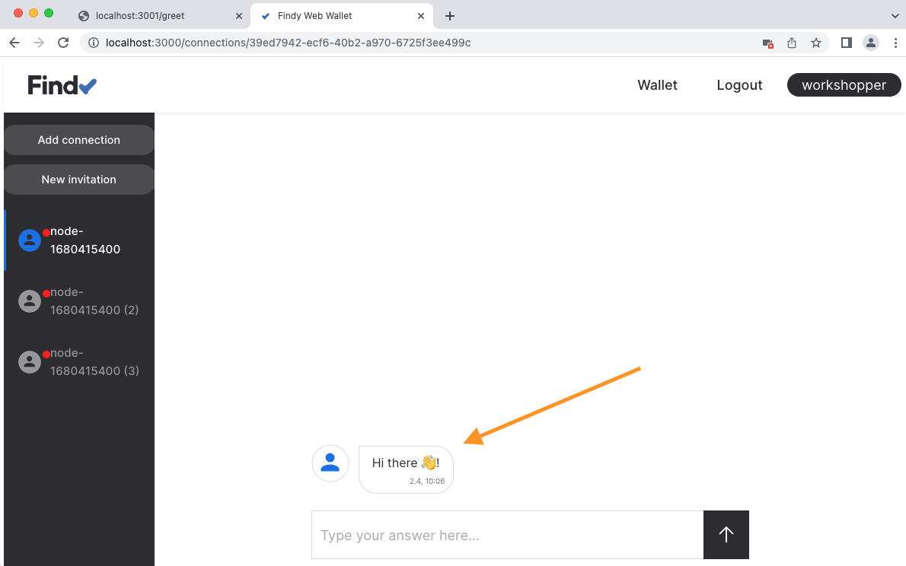
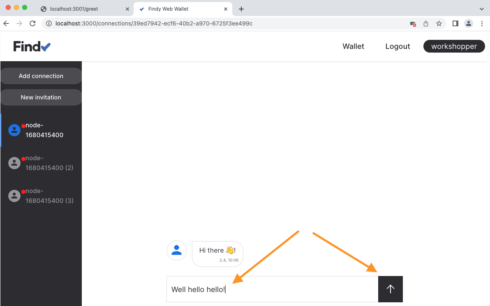

# Track 2.1 - Task 2: Send greetings

## Progress

* [Task 0: Setup environment](../README.md#task-0-setup-environment)
* [Task 1: Create a new connection](../task1/README.md#track-21---task-1-create-a-new-connection)
* **Task 2: Send greetings**
* [Task 3: Prepare for issuing credentials](../task3/README.md#track-21---task-3-prepare-for-issuing-credentials)
* [Task 4: Issue credential](../task4/README.md#track-21---task-4-issue-credential)
* [Task 5: Verify credential](../task5/README.md#track-21---task-5-verify-credential)
* [Task 6: Issue credential for verified information](../task6/README.md#track-21---task-6-issue-credential-for-verified-information)
* [Task 7: Additional tasks](../task7/README.md#track-21---task-7-additional-tasks)

## Description

In the previous task, we learned how to establish e2e-encrypted messaging pipes between agents. Now
we send our first messages using this communication pipe.

Agents interact using Hyperledger Aries protocols. There are different protocols for different purposes.
Agents send text messages to each other using
[basic message protocol](https://github.com/hyperledger/aries-rfcs/blob/main/features/0095-basic-message/README.md).

### Task sequence


In this task:

We will create a new connection according to [the steps in task 1](../task1/README.md#task-sequence).
We have already the logic for that in place.
In addition, we will add logic to the application to send and receive basic messages:

1. Once the connection protocol is complete, the application is notified of the new connection.
1. Application sends a greeting to the new connection.
1. Application agent initiates the **Aries basic message protocol**.
1. Once the protocol is completed, the application is notified of the message sending success.
1. Once the protocol is completed, the wallet user is notified of the received message.
1. Wallet user sends a message to the application.
1. User agent initiates the **Aries basic message protocol**.
1. Once the protocol is completed, the wallet user is notified of the message sending success
(message is displayed in the chat view).
1. Once the protocol is completed, the application is notified of the received message.



## 1. Use protocol API client to send a text to the other agent

In the previous task, we added a handler for new connection notifications.
Modify this handler so that when a new connection gets created, we send a greeting
to the other agent.

Open file `src/listen.ts`.

Add **`agencyv1`** to objects imported from `findy-common-ts`:

```ts
import { agencyv1, AgentClient, ProtocolClient } from '@findy-network/findy-common-ts'
```

Modify handler `DIDExchangeDone` to following:

```ts
      // New connection is established
      DIDExchangeDone: async (info, didExchange) => {
        console.log(`New connection: ${didExchange.getTheirLabel()} with id ${info.connectionId}`)

        // Greet each new connection with basic message
        const msg = new agencyv1.Protocol.BasicMessageMsg()
        msg.setContent('Hi there 👋!')
        await protocolClient.sendBasicMessage(info.connectionId, msg)
      },
```

## 2. Ensure the message is sent to the web wallet

Refresh the `/greet`-page and create a new connection using the web wallet UI.
Check that the greeting is received in the web wallet UI.



## 3. Add handler for received messages

Continue editing file `src/listen.ts`.

Add new handler `BasicMessageDone` to listener.
When receiving messages from other agents, print them to log:

```ts
      DIDExchangeDone: async (info, didExchange) => {
        ...
      },

      BasicMessageDone: async (info, basicMessage) => {
        // Print out greeting sent from the other agent
        if (!basicMessage.getSentByMe()) {
          const msg = basicMessage.getContent()
          console.log(`Received basic message ${msg} from ${info.connectionId}`)
        }
      },
```

## 4. Ensure the received message is printed to logs

Send a reply from the web wallet UI:



Check that the sent message is visible in the server logs:


## 5. Continue with task 3

Congratulations, you have completed task 2, and now know how to send and receive
basic messages with the Hyperledger Aries protocol!
To revisit what happened, check [the sequence diagram](#task-sequence).

You can now continue with [task 3](../task3/README.md).
