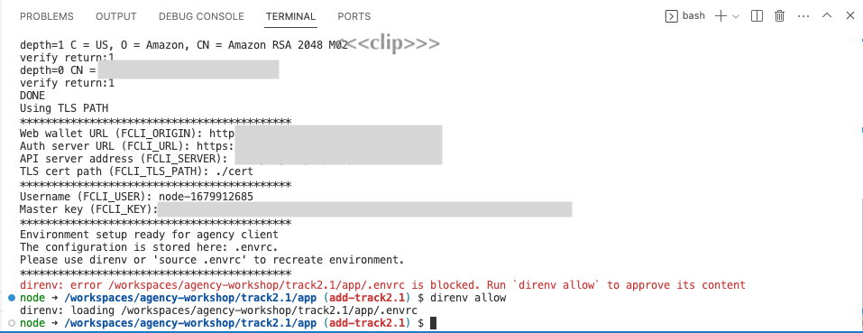

# Track 2.1: Typescript application

In this track, you will learn how to build a Typescript application that utilizes Findy Agency API
for issuing and verifying credentials. Follow the instructions carefully and
execute the tasks in order. Good luck!

## Task 0: Setup environment

1. **Clone this repository** to your workspace:

    ```shell
    git clone https://github.com/findy-network/agency-demo.git
    ```

1. **Install tooling**

    The recommended tooling for the Typescript track is to use
    [the Dev Container feature](https://code.visualstudio.com/docs/devcontainers/containers) in VS Code.

    For **the recommended tooling**, you need to have the following:
      * [VS Code](https://code.visualstudio.com/)
      * [Docker](https://www.docker.com/)

    If you wish to avoid VS Code and Dev Containers, you need to have the following tools available natively:
      * Code editor of your choice
      * [Node.js](https://nodejs.org/en) (or [nvm](https://github.com/nvm-sh/nvm#intro))
      * [findy-agent-cli](https://github.com/findy-network/findy-agent-cli#installation)
      * [direnv](https://direnv.net/) (*optional*)

1. Install Findy Agency (*optional*)

    If you are participating in a guided workshop,
    you will likely have a cloud installation of Findy Agency available. Skip this step.

    Otherwise, start local agency instance. See instructions [here](../agency-local/README.md).

1. **Open the Typescript application in a dev container**

    Open folder `./track2.1/app` to VS Code.

    VS Code asks if you want to develop the project in a dev container. Click "Reopen in Container."

    

    If you do not see this dialog, activate the dev container menu using the dev container button
    on the bottom left corner:

    

    It will take a while for VS Code to pull and set up your dev container.
    When it completes the process, VS Code opens a new Terminal window for you
    to the root of the Typescript application.

    

1. Set environment variables

    The agency environment provides a script for setting up the needed environment variables automatically.

    **Run following script** in the dev container terminal:

    ```bash
    source <(curl <agency_url>/set-env.sh)
    ```

    For cloud installation, use the cloud URL e.g. `https://agency.example.com`
    This URL is provided for you in the guided workshop.

    For local agency installation, use the web wallet URL: `http://localhost:3000`

    The script will export the needed environment variables. It will also create file `.envrc`
    that contains these variables. Typing `direnv allow` will ensure that the variables
    are automatically exported when you open a new terminal window in this folder.
    If you don't have direnv installed, you can export the variables by typing `source .envrc`.

    

    *Note! By default, the script will generate a generic username for your client.
    If you wish to use a more descriptive name for your app, define it before running the script:*

    ```bash
    export FCLI_USER="my-fancy-issuer-service"

    source <(curl <agency_url>/set-env.sh)
    ```

    *The username needs to be unique in the agency context.*

1. **Start the application** for the first time

    When starting the application for the first time, run following commands:

    ```bash
    nvm use
    npm install
    npm run build
    npm run dev     # start server in watch mode
    ```

    After the first start, you can use just `npm run dev`.

    When the server is started, VS Code displays a dialog telling where to find the app.

    

    Click "Open in Browser". The browser should open to URL <http://localhost:3001>
    and display the text "Typescript example".

    Now you have a simple express server running in port 3001 with three endpoints:
    `/`, `/issue` and `/verify`. Next step is to start adding some actual code to the server skeleton.

1. **Create connection to the agency**

    Add a new dependency to your project:

    ```bash
    npm install @findy-network/findy-common-ts --save
    ```

    `findy-common-ts` library has functionality that helps us authenticate to the agency
    or use the agent capabilities.

    Open file `src/index.ts`.

    Add following row to imports:

    ```ts
    import { agencyv1, createAcator, openGRPCConnection } from '@findy-network/findy-common-ts'
    ```

    Create new function `setupAgentConnection`:

    ```ts
      const setupAgentConnection = async () => {
        const acatorProps = {
          authUrl: process.env.FCLI_URL || 'http://localhost:8088',
          authOrigin: process.env.FCLI_ORIGIN || 'http://localhost:3000',
          userName,
          key: process.env.FCLI_KEY || '15308490f1e4026284594dd08d31291bc8ef2aeac730d0daf6ff87bb92d4336c',
        }
        const authenticator = createAcator(acatorProps)

        const serverAddress = process.env.AGENCY_API_SERVER || 'localhost'
        const certPath = process.env.FCLI_TLS_PATH || ''
        const grpcProps = {
          serverAddress,
          serverPort: parseInt(process.env.AGENCY_API_SERVER_PORT || '50052', 10),
          // NOTE: we currently assume that we do not need certs for cloud installation
          // as the cert is issued by a trusted issuer
          certPath: serverAddress === 'localhost' ? certPath : ''
        }

        // Authenticate and open GRPC connection to agency
        return openGRPCConnection(grpcProps, authenticator)
      }
    ```
