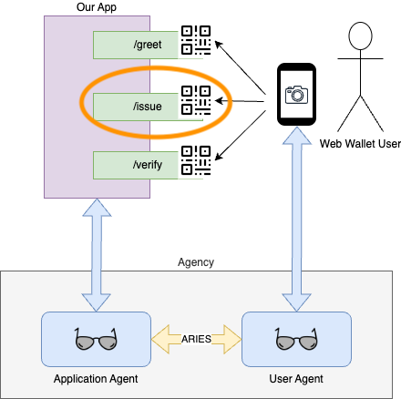
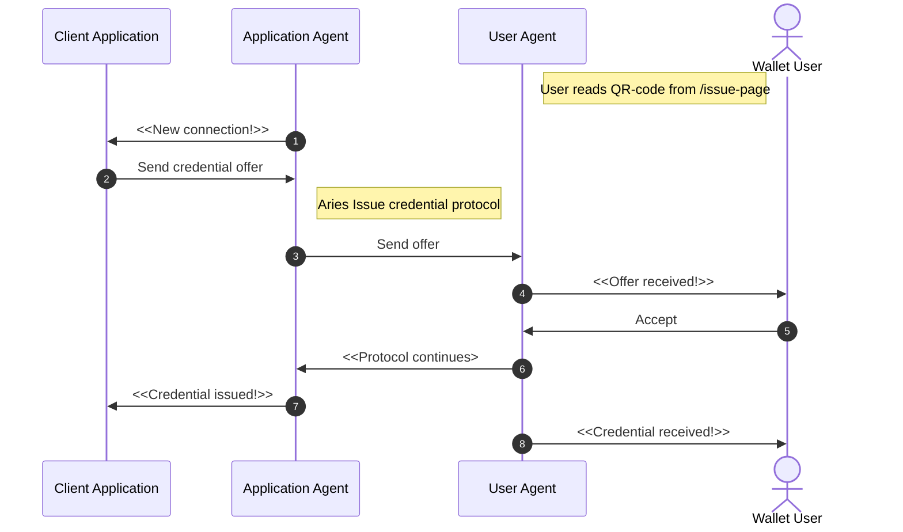
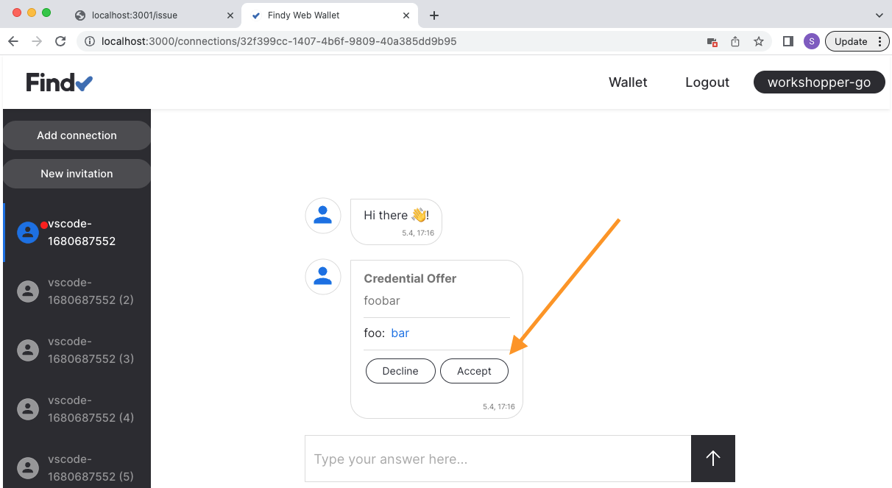
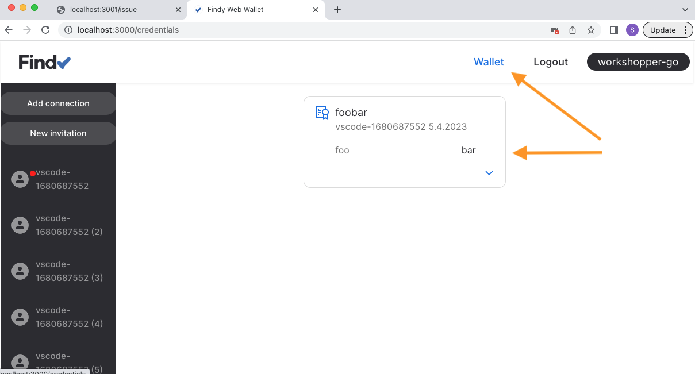

# Track 2.2 - Task 4: Issue credential

## Progress

* [Task 0: Setup environment](../README.md#task-0-setup-environment)
* [Task 1: Create a new connection](../task1/README.md#track-22---task-1-create-a-new-connection)
* [Task 2: Send greetings](../task2/README.md#track-22---task-2-send-greetings)
* [Task 3: Prepare for issuing credentials](../task3/README.md#track-22---task-3-prepare-for-issuing-credentials)
* **Task 4: Issue credential**
* [Task 5: Verify credential](../task5/README.md#track-22---task-5-verify-credential)
* [Task 6: Issue credential for verified information](../task6/README.md#track-22---task-6-issue-credential-for-verified-information)
* [Task 7: Additional tasks](../task7/README.md#track-22---task-7-additional-tasks)

## Description

Now that we have completed setting up the basic bells and whistles, we can start the real fun
with issuing and verifying credentials.

First, let's issue a dummy credential to the web wallet user and verify it afterward.
In a real-world application, the issuer would naturally know something about the user
and issue a credential only with validated information. But for this case,
we issue a dummy credential to all users connecting with us.

Agents use [the issue credential protocol](https://github.com/hyperledger/aries-rfcs/blob/main/features/0036-issue-credential/README.md)
when handling the issuing process. Luckily, Findy Agency handles the execution of this complex
protocol for us (similarly to other Hyperledger Aries protocols).

### Task sequence



In this task:

We will create a new connection according to [the steps in task 1](../task1/README.md#task-sequence)
when the user reads the QR code in `/issue`-endpoint.
We have already the most of the logic for that in place.
In addition, we will add logic to the application to issue credentials:

1. Once the connection protocol is complete, the application is notified of the new connection.
1. Application sends a credential offer to the new connection.
1. Application agent initiates the **Aries issue credential protocol**.
1. Wallet user gets a notification of the offer.
1. Wallet user accepts the offer.
1. Issue credential protocol continues.
1. Once the protocol is completed, the application is notified of the issuing success.
1. Once the protocol is completed, the wallet user is notified of the received credential.



## 1. Listen to issue credential protocol

Open file `agent/listen.go`.
Add new method `HandleIssueCredentialDone` to listener interface:

```go
type Listener interface {
  HandleNewConnection(*agency.Notification, *agency.ProtocolStatus_DIDExchangeStatus)
  HandleBasicMesssageDone(*agency.Notification, *agency.ProtocolStatus_BasicMessageStatus)
  // Send notification to listener when issue credential protocol is completed
  HandleIssueCredentialDone(*agency.Notification, *agency.ProtocolStatus_IssueCredentialStatus)
}
```

When receiving notification for the issue credential protocol, notify listeners via the new method.
Edit `Listen`-function:

```go

  ...

func (agencyClient *AgencyClient) Listen(listeners []Listener) {

  ...

   // Notify listeners of protocol events
   switch notification.GetTypeID() {
   case agency.Notification_STATUS_UPDATE:
      if status.State.State == agency.ProtocolState_OK {
      switch notification.GetProtocolType() {

    ...

      case agency.Protocol_BASIC_MESSAGE:
        for _, listener := range listeners {
          listener.HandleBasicMesssageDone(notification, status.GetBasicMessage())
        }
      // Notify issue credential protocol events
      case agency.Protocol_ISSUE_CREDENTIAL:
        for _, listener := range listeners {
          listener.HandleIssueCredentialDone(notification, status.GetIssueCredential())
        }

      ... 
   }

  ...

}
```

## 2. Add code for issuing logic

Create a new file `handlers/issuer.go`.

Add the following content to the new file:

```go
package handlers

import (
  "context"
  "log"
  "sync"

  "github.com/findy-network/agency-workshop/agent"
  "github.com/findy-network/findy-common-go/agency/client"
  "github.com/findy-network/findy-common-go/agency/client/async"
  agency "github.com/findy-network/findy-common-go/grpc/agency/v1"
  "github.com/lainio/err2"
  "github.com/lainio/err2/try"
)

type Issuer struct {
  agent.DefaultListener
  conn        client.Conn
  connections sync.Map
  credDefID   string
}

type connection struct {
  id string
}

func NewIssuer(conn client.Conn, credDefID string) *Issuer {
  return &Issuer{
    conn:      conn,
    credDefID: credDefID,
  }
}

func (i *Issuer) getConnection(id string) *connection {
  if anyConn, ok := i.connections.Load(id); ok {
    if conn, ok := anyConn.(*connection); ok {
      return conn
    }
  }
  return nil
}

func (i *Issuer) AddInvitation(id string) {
  i.connections.Store(id, &connection{id: id})
}

func (i *Issuer) HandleNewConnection(
  notification *agency.Notification,
  status *agency.ProtocolStatus_DIDExchangeStatus,
) {
  defer err2.Catch(err2.Err(func(err error) {
    log.Printf("Error handling new connection: %v", err)
  }))

  conn := i.getConnection(notification.ConnectionID)

  if conn == nil {
    // Connection was not for issuing, skip
    return
  }

  // Create credential content
  attributes := make([]*agency.Protocol_IssuingAttributes_Attribute, 1)
  attributes[0] = &agency.Protocol_IssuingAttributes_Attribute{
    Name:  "foo",
    Value: "bar",
  }

  log.Printf(
    "Offer credential, conn id: %s, credDefID: %s, attrs: %v",
    notification.ConnectionID,
    i.credDefID,
    attributes,
  )

  // Send credential offer to the other agent
  pw := async.NewPairwise(i.conn, notification.ConnectionID)
  res := try.To1(pw.IssueWithAttrs(
    context.TODO(),
    i.credDefID,
    &agency.Protocol_IssuingAttributes{
    Attributes: attributes,
    }),
  )

  log.Printf("Credential offered: %s", res.GetID())
}

func (i *Issuer) HandleIssueCredentialDone(
  notification *agency.Notification,
  status *agency.ProtocolStatus_IssueCredentialStatus,
) {
  conn := i.getConnection(notification.ConnectionID)

  if conn == nil {
    // Connection was not for issuing, skip
    return
  }

  log.Printf(
    "Credential issued to: %s, with id: %s",
    notification.ConnectionID,
    notification.ProtocolID,
  )

  i.connections.Delete(notification.ConnectionID)
}

```

## 3. Implement the `/issue`-endpoint

Open file `main.go`.

Add new field to `app` state struct:

```go
type app struct {
  agencyClient *agent.AgencyClient
  greeter      *handlers.Greeter
  // Issuer handles the issuing logic
  issuer       *handlers.Issuer
}
```

Modify function `main`.
Create the `issuer` and give it as a parameter on listener initialization:

```go
func main() {

  ...

  // Create credential definition
  credDefId := try.To1(agencyClient.PrepareIssuing())

  // Create handlers
  myApp := app{
    agencyClient: agencyClient,
    greeter:      handlers.NewGreeter(agencyClient.Conn),
    issuer:       handlers.NewIssuer(agencyClient.Conn, credDefId),
  }

  // Start listening
  myApp.agencyClient.Listen([]agent.Listener{
    myApp.greeter,
    // Issuer handles the issuing logic
    myApp.issuer,
  })

  ...

}
```

Replace the implementation in the `/issue`-endpoint with the following:

```go
// Show pairwise invitation. Once connection is established, issue credential.
func (a *app) issueHandler(response http.ResponseWriter, r *http.Request) {
  defer err2.Catch(err2.Err(func(err error) {
    log.Println(err)
    http.Error(response, err.Error(), http.StatusInternalServerError)
  }))
  id, html := try.To2(createInvitationPage(a.agencyClient.AgentClient, "Issue"))
  a.issuer.AddInvitation(id)
  try.To1(response.Write([]byte(html)))
}
```

## 4. Test the `/issue`-endpoint

Make sure the server is restarted (`go run .`).
Open your browser to <http://localhost:3001/issue>

*You should see a simple web page with a QR code and a text input with a prefilled string.*


## 5. Read the QR code with the web wallet

Add the connection in the same way as in [task 1](../task1/README.md#6-read-the-qr-code-with-the-web-wallet):
Tap the "Add connection" button in your web wallet and read the QR code with your mobile device. Alternatively,
you can copy-paste the invitation string to the "Add connection"-dialog.

## 6. Ensure the credential offer is received in the web wallet

Accept the credential offer.



Check the wallet view that the credential is stored there.



## 7. Check the server logs

Ensure that server logs display the success for the issue protocol:


## 8. Continue with task 5

Congratulations, you have completed task 4, and know now how to issue
credentials!
To revisit what happened, check [the sequence diagram](#task-sequence).

You can now continue with [task 5](../task5/README.md).
