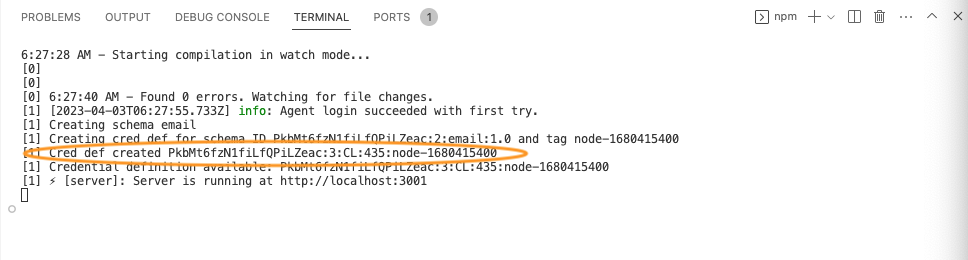
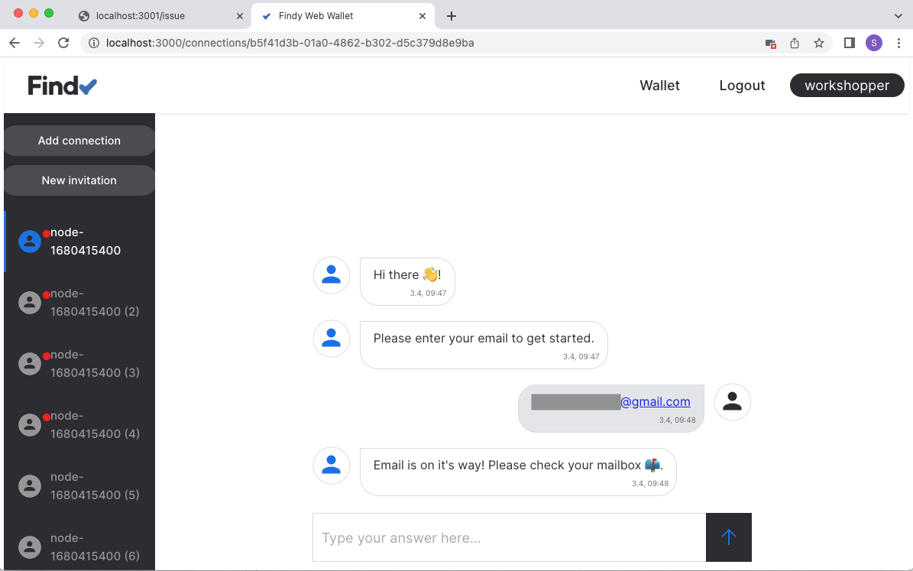
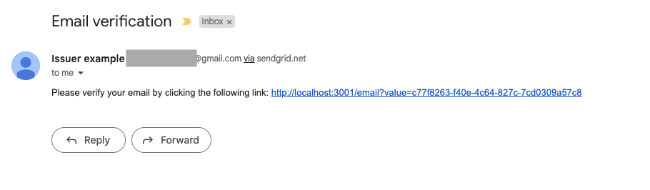
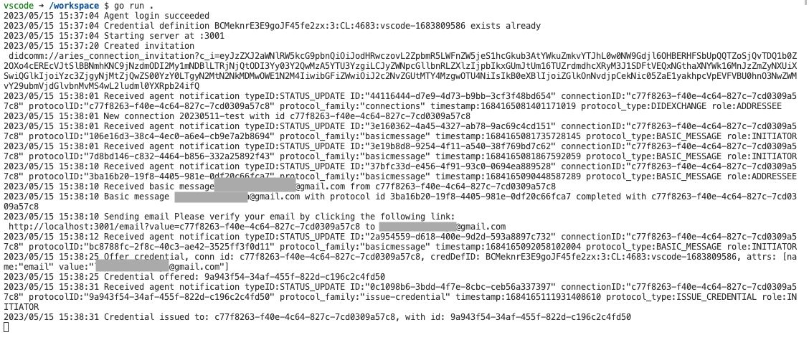

# Track 2.2 - Task 6: Issue credential for verified information

## Progress

* [Task 0: Setup environment](../README.md#task-0-setup-environment)
* [Task 1: Create a new connection](../task1/README.md#track-22---task-1-create-a-new-connection)
* [Task 2: Send greetings](../task2/README.md#track-22---task-2-send-greetings)
* [Task 3: Prepare for issuing credentials](../task3/README.md#track-22---task-3-prepare-for-issuing-credentials)
* [Task 4: Issue credential](../task4/README.md#track-22---task-4-issue-credential)
* [Task 5: Verify credential](../task5/README.md#track-22---task-5-verify-credential)
* **Task 6: Issue credential for verified information**
* [Task 7: Additional tasks](../task7/README.md#track-22---task-7-additional-tasks)

## Description

In our previous issuing example, we issued a `foobar` credential to anyone who connects with us.
However, this is not a likely real-world scenario. Probably the issuer wishes to issue some
meaningful data that it knows to be valid.

Let's change our issuer so that it issues credentials for a verified email. The issuer displays
a QR code as before, but when the connection is established, it will ask for the user's email address.
It sends an email with a verification URL to this address. Only when a user opens the verification URL
issuer will send the credential offer.

We must create a new schema and credential definition to issue email credentials. We also
need to create logic for asking for the email address. In addition, a new endpoint needs to be added
for the verification URL.

In this task, we will utilize SendGrid API for sending emails. You need an API key
to access the SendGrid API. You will be provided one in the guided workshop.

<details>
<summary>🤠 Acquire SendGrid API key</summary></br>

Create a free account to SendGrid and acquire the API key:
<https://sendgrid.com/solutions/email-api/>

Configure and verify also a sender identity for your email address.

</details></br>

## 1. Install SendGrid dependency

Stop your server (C-c).

Install the helper library:

```bash
go get github.com/sendgrid/sendgrid-go
```

## 2. Export environment variables for SendGrid API access

Open file `.envrc`. Add two new environment variables there:

```bash
export SENDGRID_API_KEY='<this_value_will_be_provided_for_you_in_the_workshop>'
export SENDGRID_SENDER='<this_value_will_be_provided_for_you_in_the_workshop>'
```

Save the file and type `direnv allow`.

<details>
<summary>🤠 Configure your own SendGrid account</summary></br>

Create API key with SendGrid UI and replace the value to `SENDGRID_API_KEY` variable.
Configure the verified sender email to `SENDGRID_SENDER` variable.

</details></br>

## 3. Create new credential definition

In [task 3](../task3/README.md), we created a schema and credential definition for `foobar`-credentials.
Now we need another schema and credential definition for our email credential.

Let's modify our code for creating the schema and the credential definition.

Open file `agent/prepare.go`.

Modify function `PrepareIssuing`. Change the `schemaName` to `"email"` and attributes list to `"email"`:

```go
func (a *AgencyClient) PrepareIssuing() (credDefID string, err error) {
  defer err2.Handle(&err)

  const credDefIDFileName = "CRED_DEF_ID"
  const schemaName = "email"
  schemaAttributes := []string{"email"}

  ...
```

Then delete (or rename) file `CRED_DEF_ID` from the workspace root.
This ensures that the schema and credential definition creation code is executed on server startup,
as there is no cached credential definition id.

```bash
mv CRED_DEF_ID foobar_CRED_DEF_ID
```

Start your server `go run .`.

## 4. Ensure credential definition for email schema is created

Note! It will take a while for the agency to create a new credential definition.
Wait patiently.



## 5. Modify issuer for email changes

Open file `handlers/issuer.go`.

Add following rows to imports:

```go
import (

  ...

  "github.com/sendgrid/sendgrid-go"
  "github.com/sendgrid/sendgrid-go/helpers/mail"

  ...
)
```

Create new global variable for SendGrid client using the API key:

```go
var (
  sgClient = sendgrid.NewSendClient(os.Getenv("SENDGRID_API_KEY"))
)
```

Add new fields to `email` and `verified` to `Connection`-interface:

```go
type connection struct {
  id string
  email string
  verified bool
}
```

Add new utility functions `askForEmail` and `sendEmail`
for sending messages:

```go
func (i *Issuer) askForEmail(connectionID string) (err error) {
  defer err2.Handle(&err)

  // Ask for user email via basic message
  pw := async.NewPairwise(i.conn, connectionID)
  _ = try.To1(pw.BasicMessage(context.TODO(), "Please enter your email to get started."))

  return err
}

func (i *Issuer) sendEmail(content, email string) (err error) {
  defer err2.Handle(&err)

  from := mail.NewEmail("Issuer example", os.Getenv("SENDGRID_SENDER"))
  subject := "Email verification"
  to := mail.NewEmail(email, email) // Change to your recipient
  message := mail.NewSingleEmail(from, subject, to, content, content)

  log.Printf("Sending email %s to %s", content, email)
  _ = try.To1(sgClient.Send(message))

  return err
}

```

Instead of issuing the credential when a new connection is established,
we want to ask the user for their email and send the credential offer
only after verifying their email. So when a new connection is established,
we send a basic message asking for the email.
Replace the contents of `HandleNewConnection` with following:

```go
func (i *Issuer) HandleNewConnection(
  notification *agency.Notification,
  status *agency.ProtocolStatus_DIDExchangeStatus,
) {
  defer err2.Catch(func(err error) {
    log.Printf("Error handling new connection: %v", err)
  })

  conn := i.getConnection(notification.ConnectionID)

  if conn == nil {
    // Connection was not for issuing, skip
    return
  }

  if conn.email == "" {
    i.askForEmail(conn.id)
  }
}

```

Add new function `HandleBasicMesssageDone`. This function will handle the basic messages the user
is sending from the other end. If the user replies with an email address, a verification email is sent
to the provided address.

```go
func (i *Issuer) HandleBasicMesssageDone(
  notification *agency.Notification,
  status *agency.ProtocolStatus_BasicMessageStatus,
) {
  defer err2.Catch(func(err error) {
    log.Printf("Error handling basic message: %v", err)
  })

  conn := i.getConnection(notification.ConnectionID)

  // Skip handling if
  // 1. Connection was not for issuing
  // 2. Message was sent by us
  // 3. Email has been already asked
  if conn == nil || status.SentByMe || conn.email != "" {
    return
  }

  msg := status.Content
  msgValid := len(strings.Split(msg, " ")) == 1 && strings.Contains(msg, "@")

  log.Printf("Basic message %s with protocol id %s completed with %s",
    msg, notification.ProtocolID, conn.id)

  if msgValid {
    i.connections.Store(conn.id, &connection{id: conn.id, email: msg})

    // Create simple verification link
    // Note: in real-world we should use some random value instead of the connection id
    content := fmt.Sprintf("Please verify your email by clicking the following link:\n http://localhost:3001/email?value=%s", conn.id)
    i.sendEmail(content, msg)

    // Send confirmation via basic message
    pw := async.NewPairwise(i.conn, conn.id)
    _ = try.To1(pw.BasicMessage(context.TODO(), "Email is on it's way! Please check your mailbox 📫."))

  } else {
    // If email is invalid, ask again
    i.askForEmail(conn.id)
  }
}
```

Add new function `SetEmailVerified`. This function will send a credential offer
of a verified email when the user has clicked the verification link.

```go
func (i *Issuer) SetEmailVerified(connectionID string) (err error) {
  defer err2.Handle(&err)

  conn := i.getConnection(connectionID)

  // Skip handling if
  // 1. Connection was not for issuing
  // 2. Email has not been saved
  // 3. Credential has been already issued
  if conn == nil || conn.email == "" || conn.verified {
    return
  }

  i.connections.Store(conn.id, &connection{id: conn.id, email: conn.email, verified: true})

  // Create credential content
  attributes := make([]*agency.Protocol_IssuingAttributes_Attribute, 1)
  attributes[0] = &agency.Protocol_IssuingAttributes_Attribute{
    Name:  "email",
    Value: conn.email,
  }

  log.Printf(
    "Offer credential, conn id: %s, credDefID: %s, attrs: %v",
    conn.id,
    i.credDefID,
    attributes,
  )

  // Send credential offer to the other agent
  pw := async.NewPairwise(i.conn, conn.id)
  res := try.To1(pw.IssueWithAttrs(
    context.TODO(),
    i.credDefID,
    &agency.Protocol_IssuingAttributes{
      Attributes: attributes,
    }),
  )

  log.Printf("Credential offered: %s", res.GetID())
  return nil
}
```

## 5. Add endpoint for email verification

Open file `main.go`.

Add a new endpoint that handles email URL clicks.
The function asks the issuer to send a credential offer if the connection is valid and found.

```go
// Email verification
func (a *app) emailHandler(response http.ResponseWriter, r *http.Request) {
  defer err2.Catch(func(err error) {
    log.Println(err)
    http.Error(response, err.Error(), http.StatusInternalServerError)
  })

  values := r.URL.Query()
  connID := values.Get("value")

  var html = `<html><h1>Error</h1></html>`
  if a.issuer.SetEmailVerified(connID) == nil {
    html = `<html>
    <h1>Offer sent!</h1>
    <p>Please open your wallet application and accept the credential.</p>
    <p>You can close this window.</p></html>`
  }
  try.To1(response.Write([]byte(html)))
}
```

Add new endpoint to router:

```go
  router.HandleFunc("/email", myApp.emailHandler)
```

## 6. Testing

Now you should have the needed bits and pieces in place. Let's test if it works.

Navigate to page <http://localhost:3001/issue> and
create a new pairwise connection to your web wallet user.
The app should ask you for your email. Input a valid email address that you have access to.


The application sends the verification email and basic message telling the user to check their inbox.



Check your inbox and navigate to the verification link with your desktop browser.



Check the web wallet view and accept the credential offer.


Review server logs.



## 7. Continue with task 7

Congratulations, you have completed task 6 and now know a little more about
how to build the application logic for issuers!

You can now continue with [task 7](../task7/README.md).
