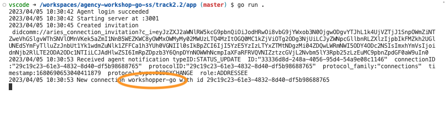

# Track 2.2 - Task 1: Create a new connection

## Progress

* [Task 0: Setup environment](../README.md#task-0-setup-environment)
* **Task 1: Create a new connection**
* [Task 2: Send greetings](../task2/README.md#track-21---task-2-send-greetings)
* [Task 3: Prepare for issuing credentials](../task3/README.md#track-21---task-3-prepare-for-issuing-credentials)
* [Task 4: Issue credential](../task4/README.md#track-21---task-4-issue-credential)
* [Task 5: Verify credential](../task5/README.md#track-21---task-5-verify-credential)
* [Task 6: Issue credential for verified information](../task6/README.md#track-21---task-6-issue-credential-for-verified-information)
* [Task 7: Additional tasks](../task7/README.md#track-21---task-7-additional-tasks)

## Description

An agent's primary capability is peer-to-peer messaging, which allows for exchanging messages
between agents. These interactions can range from simple plaintext messages to more complex tasks
such as negotiating the issuance of a credential or presenting proof. The peer-to-peer
messaging mechanism is called DIDComm, which is short for DID communication and operates based
on the exchange and use of DIDs.

Establishing a DIDComm connection requires one agent to generate an invitation and
transfer the invitation to the other agent. Typically the invitation is displayed as a QR code
that the other agent can read using a mobile device. The connection negotiation can then begin using
the information in the invitation. Eventually, the agents have a secure, e2e-encrypted
communication pipeline that they can use to transmit other protocol messages.

## 1. Add library for creating QR codes

Add a new dependency to your project:

```bash
go get github.com/skip2/go-qrcode
```

This library will enable us to transform strings into QR codes.

Open file `main.go`.

Add following rows to imports:

```go
import (

  ...
  agency "github.com/findy-network/findy-common-go/grpc/agency/v1"
  qrcode "github.com/skip2/go-qrcode"
)
```

## 2. Create a connection invitation

Add new function `createInvitationPage` for creating an HTML page
with connection invitation information:

```go
func createInvitationPage(
  agentClient agency.AgentServiceClient,
  header string,
) (html, invitationID string, err error) {
  defer err2.Handle(&err)

  // Agency API call for creating the DIDComm connection invitation
  res := try.To1(agentClient.CreateInvitation(
    context.TODO(),
    // Whichever name we want to expose from ourselves to the other end
    &agency.InvitationBase{Label: os.Getenv("FCLI_USER")},
  ))

  var invitationMap map[string]any
  try.To(json.Unmarshal([]byte(res.GetJSON()), &invitationMap))

  url := res.URL
  log.Printf("Created invitation\n %s\n", url)

  // Convert invitation string to QR code
  png, err := qrcode.Encode(url, qrcode.Medium, 512)
  imgSrc := "data:image/png;base64," + base64.StdEncoding.EncodeToString([]byte(png))

  // Create HTML payload
  html = `<html>
      <h1>` + header + `</h1>
      <p>Read the QR code with the wallet application:</p>
      
      <p>or copy-paste the invitation:</p>
      <textarea onclick="this.focus();this.select()" readonly="readonly" rows="10" cols="60">` +
    url + `</textarea></html>`

  // Return invitation id and the HTML payload
  return invitationMap["@id"].(string), html, nil
}
```

## 3. Implement the `/greet`-endpoint

Let's add implementation to the `/greet`-endpoint.
The function should respond with an HTML page that renders a QR code for a DIDComm connection invitation.

First, store the agent API client reference returned when opening the agency connection.
Add new field `agentClient` to `appState`-struct:

```go
type appState struct {
  agentClient agency.AgentServiceClient
}
```

Modify `LoginAgent`-call to the following:

```go
  // Login agent
  agentClient, _ := try.To2(agent.LoginAgent())
  app := appState{
    agentClient: agentClient,
  }

```

Then, add implementation to the `/greet`-endpoint:

```go
// Show pairwise invitation. Once connection is established, send greeting.
func greetHandler(app appState) http.HandlerFunc {
  return func(response http.ResponseWriter, r *http.Request) {
    defer err2.Catch(func(err error) {
      log.Println(err)
      http.Error(response, err.Error(), http.StatusInternalServerError)
    })
    _, html := try.To2(createInvitationPage(app.agentClient, "Greet"))
    try.To1(response.Write([]byte(html)))
  }
}
```

## 4. Test the `/greet`-endpoint

Make sure the server is running (`npm run dev`).
Open a browser window to <http://localhost:3001/greet>

*You should see a simple web page with a QR code and a text input with a prefilled string.*


## 5. Register test user to web wallet

You should read the QR code with the web wallet to test the connection creation.
Navigate to the web wallet URL with your mobile device or open a new tab in your desktop browser.

*You can find the web wallet URL in the `.envrc`-file stored in your workspace root.
Navigate with your browser to the URL that is stored in the `FCLI_ORIGIN`-variable.*

<details>
<summary>🤠 Local setup</summary></br>

If you are using a local agency installation, you should use your desktop browser only.

</details><br/>

Pick a unique username for your web wallet user. Register and log in with your web wallet user
using your touch/face id. See the gif below if in doubt.


<details>
<summary>🤠 Authenticator emulation</summary></br>

FIDO2 authenticators can also be emulated. See [Chrome instructions](https://developer.chrome.com/docs/devtools/webauthn/)
for more information.

</details><br/>

## 6. Read the QR code with the web wallet

Tap the "Add connection" button in your web wallet and read the QR code with your mobile device. Alternatively,
copy-paste the invitation string to the input-field and click *Confirm*.


## 7. Ensure the new connection is visible in the web wallet

Check that the connections list displays the name of your client application,
and a messaging UI is visible for you.


## 8. Add agent listener

Now we have a new pairwise connection to the web wallet user that the agent negotiated for us.
However, we don't know about it, as we haven't set a listener for our agent. Let's do that next.

Create a new file `src/listen.ts`.

Add the following content to the new file:

```ts
import { AgentClient, ProtocolClient } from '@findy-network/findy-common-ts'

export default async (
  agentClient: AgentClient,
  protocolClient: ProtocolClient,
) => {

  // Options for listener
  const options = {
    protocolClient,
    retryOnError: true,
  }

  // Listening callback handles agent events
  await agentClient.startListeningWithHandler(
    {
      // New connection is established
      DIDExchangeDone: async (info, didExchange) => {
        console.log(`New connection ${didExchange.getTheirLabel()} with id ${info.connectionId}`)
      },
    },
    options
  )
}
```

Open file `src/index.ts`.

Add the following row to imports:

```ts
import listenAgent from './listen'
```

Next, we will modify `runApp`-function to start the listening.
We will call the newly imported function and provide the needed API clients
as parameters.

```ts
const runApp = async () => {
  const { createAgentClient, createProtocolClient } = await setupAgentConnection()

  // Create API clients using the connection
  const agentClient = await createAgentClient()
  const protocolClient = await createProtocolClient()

  // Start listening to agent notifications
  await listenAgent(agentClient, protocolClient)

  ...

}
```

## 9. Check the name of the web wallet user

Refresh the `/greet`-page and create a new connection using the web wallet UI.

Check that the server logs print out the web wallet user name.



## 10. Continue with task 2

Congratulations, you have completed task 1, and you know now how to establish DIDComm connections
between agents for message exchange!

You can now continue with [task 2](../task2/README.md).
