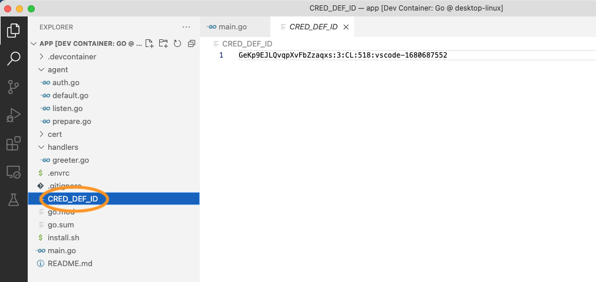

# Track 2.2 - Task 3: Prepare for issuing credentials

## Progress

* [Task 0: Setup environment](../README.md#task-0-setup-environment)
* [Task 1: Create a new connection](../task1/README.md#track-21---task-1-create-a-new-connection)
* [Task 2: Send greetings](../task2/README.md#track-21---task-2-send-greetings)
* **Task 3: Prepare for issuing credentials**
* [Task 4: Issue credential](../task4/README.md#track-21---task-4-issue-credential)
* [Task 5: Verify credential](../task5/README.md#track-21---task-5-verify-credential)
* [Task 6: Issue credential for verified information](../task6/README.md#track-21---task-6-issue-credential-for-verified-information)
* [Task 7: Additional tasks](../task7/README.md#track-21---task-7-additional-tasks)

## Description

In the previous task, we learned how to start Hyperledger Aries protocol interactions and
react to the protocol notifications utilizing the Findy Agency agent API. In the following
tasks, we will learn how to issue and verify credentials using similar APIs.

But before issuing credentials, we have to prepare our agent for it.
It means that we must have a suitable schema and credential definition available.

A schema describes the contents of the verifiable credential: which data attributes it
contains. The credential definition is like a public key published against that schema.
Other parties can verify the credential's validity against the credential definition and
ensure that your and only your agent has issued the credential.

## 1. Add code for creating credential definition

The creation of the credential definition is only needed then when we start
to issue new types of credentials. So we don't need to do it too often.

Create a new file `src/prepare.ts`.

Add the following content to the new file:

```ts
import { agencyv1, AgentClient } from '@findy-network/findy-common-ts'
import { existsSync, readFileSync, writeFileSync } from 'fs';

export default async (agentClient: AgentClient, tag: string) => {

  const waitForSchema = async (schemaId: string) => new Promise<void>((resolve) => {
    const getSchema = async () => {
      const schemaMsg = new agencyv1.Schema();
      schemaMsg.setId(schemaId)
      try {
        await agentClient.getSchema(schemaMsg)
        resolve()
      } catch {
        setTimeout(getSchema, 1000, schemaId)
        return
      }
    }
    return getSchema()
  })

  const createCredDef = async (schemaId: string): Promise<string> => {
    // wait for schema to be found on the ledger
    // note: in real applications the schema would exist already
    await waitForSchema(schemaId)

    // Create cred def for the provided tag
    console.log(`Creating cred def for schema ID ${schemaId} and tag ${tag}`)
    const msg = new agencyv1.CredDefCreate()
    msg.setSchemaid(schemaId)
    msg.setTag(tag)

    const res = await agentClient.createCredDef(msg)
    console.log(`Cred def created ${res.getId()}`)

    return res.getId()
  }

  const prepareIssuing = async (): Promise<string> => {
    // A dummy schema name
    const schemaName = 'foobar'
    console.log(`Creating schema ${schemaName}`)

    const schemaMsg = new agencyv1.SchemaCreate()
    schemaMsg.setName(schemaName)
    schemaMsg.setVersion('1.0')
    // List of dummy attributes
    schemaMsg.setAttributesList(['foo'])

    const schemaId = (await agentClient.createSchema(schemaMsg)).getId()
    return await createCredDef(schemaId)
  }

  // We store the cred def id to a text file
  const credDefIdFilePath = 'CRED_DEF_ID'
  const credDefCreated = existsSync(credDefIdFilePath)
  // Skip cred def creation if it is already created
  const credDefId = credDefCreated ? readFileSync(credDefIdFilePath).toString() : await prepareIssuing()
  if (!credDefCreated) {
    // Store id in order to avoid unnecessary creations
    writeFileSync(credDefIdFilePath, credDefId)
  }
  console.log(`Credential definition available: ${credDefId}`)

  return credDefId
}
```

## 2. Create credential definition on server start

Open file `src/index.ts`.

Add the following row to imports:

```ts
import prepare from './prepare'
```

Next, we will modify the `runApp`-function to create the credential definition on server start.
We will call the newly imported function and provide the needed API client
as parameters.

```ts
const runApp = async () => {
  const { createAgentClient, createProtocolClient } = await setupAgentConnection()

  // Create API clients using the connection
  const agentClient = await createAgentClient()
  const protocolClient = await createProtocolClient()

  // Prepare issuing and fetch credential definition id
  const credDefId = await prepare(agentClient, process.env.FCLI_USER!)

...

}
```

## 3. Ensure the credential definition is created from logs

Note! It will take a while for the agency to create a new credential definition.
Wait patiently.


## 4. Check `CRED_DEF_ID`-file

When the credential definition is created, the logic in your server code will store
the credential definition id in a text file  `CRED_DEF_ID` in the workspace root. If this file exists,
the creation of the credential definition is skipped on server start.



By default, the logic will create a schema `foobar` with one attribute `foo`. If you wish to change either
the schema name, the schema attributes or the tag of the credential definition, you need to delete
the `CRED_DEF_ID` file from the workspace root (so that the credential definition gets recreated).

For now, you can use the default values and proceed to the next tasks with the current credential
definition.

## 5. Continue with task 4

Congratulations, you have completed task 3, and you now know how to prepare your agent
to issue credentials!

You can now continue with [task 4](../task4/README.md).
