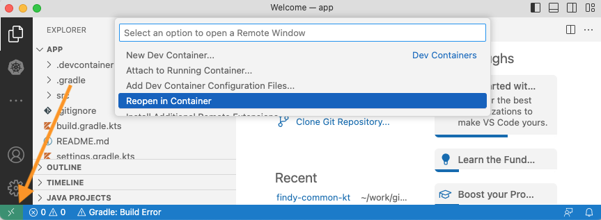
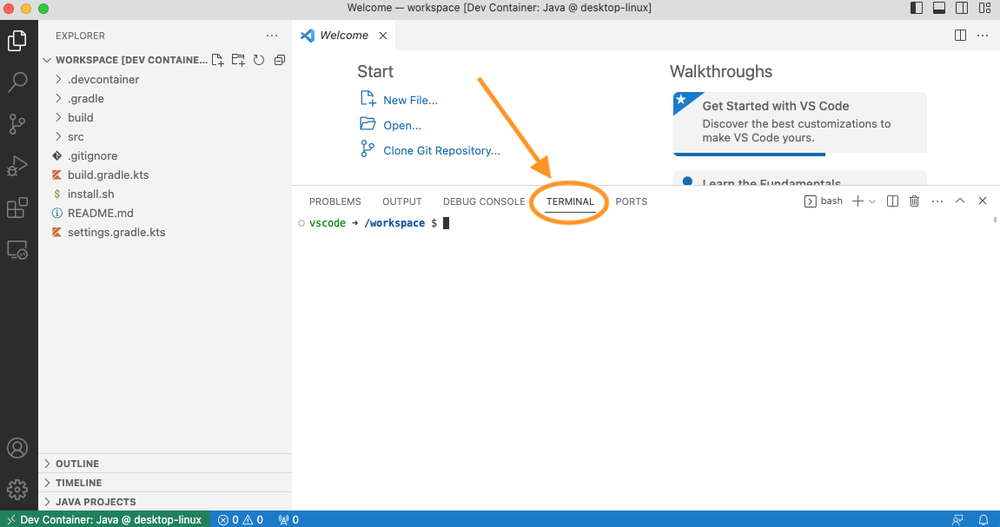
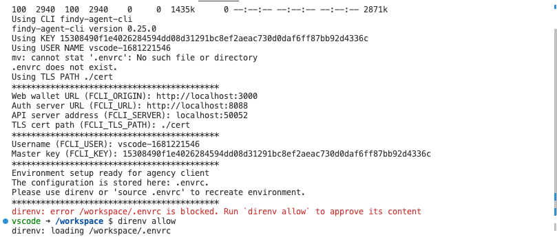
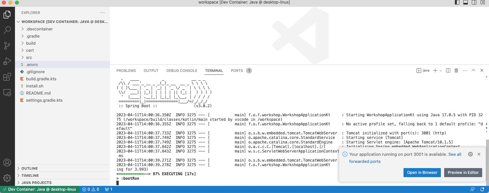
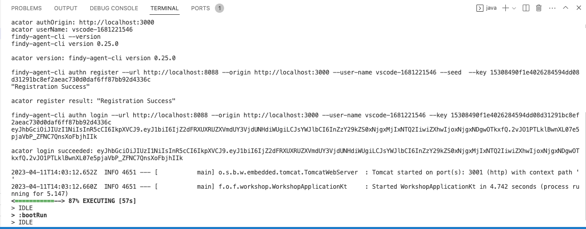

# Track 2.3: Kotlin application

In this track, you will learn how to build a Kotlin application that utilizes Findy Agency API
for issuing and verifying credentials. The assumption is that you work in a guided workshop
with the default tooling. In this case, you can skip the sections with the symbol 🤠.

The workshop contains seven tasks:

* **[Task 0: Setup environment](#task-0-setup-environment)**
* [Task 1: Create a new connection](./task1/README.md#track-21---task-1-create-a-new-connection)
* [Task 2: Send greetings](./task2/README.md#track-21---task-2-send-greetings)
* [Task 3: Prepare for issuing credentials](./task3/README.md#track-21---task-3-prepare-for-issuing-credentials)
* [Task 4: Issue credential](./task4/README.md#track-21---task-4-issue-credential)
* [Task 5: Verify credential](./task5/README.md#track-21---task-5-verify-credential)
* [Task 6: Issue credential for verified information](./task6/README.md#track-21---task-6-issue-credential-for-verified-information)
* [Task 7: Additional tasks](./task7/README.md#track-21---task-7-additional-tasks)

Follow the instructions carefully and execute the tasks in order. Good luck!

## Task 0: Setup environment

### **1. Clone this repository to your workspace**

```shell
git clone https://github.com/findy-network/agency-workshop.git
```

### **2. Install tooling**

The recommended tooling for the Kotlin track is to use
[the Dev Container feature](https://code.visualstudio.com/docs/devcontainers/containers) in VS Code.

For the recommended tooling, you need to have the following:

* [VS Code](https://code.visualstudio.com/)
* [Docker](https://www.docker.com/)

<details>
<summary>🤠 Other options</summary></br>

You can also set up the tools natively. However, these instructions describe only
how to work with the recommended tooling.

If you are experienced Kotlin developer (and use for example IntelliJ IDEA),
it probably makes most sense to work with your default setup as VSCode has some limitations
regarding Kotlin development.

Make sure you have these tools available:

* Code editor of your choice.
* JDK and Gradle
* [findy-agent-cli](https://github.com/findy-network/findy-agent-cli#installation)
* [direnv](https://direnv.net/) (*optional*)

</details><br/>

### **3. 🤠 Install Findy Agency**

If you are participating in a guided workshop,
you will likely have a cloud installation of Findy Agency available. Skip this step.

<details>
<summary>🤠 Local setup</summary></br>

Start local agency instance if you do not have cloud installation available.
See instructions [here](../agency-local/README.md).

</details><br/>

## 4. Setup authentication to GitHub registry

You need a GitHub account.

[Create personal access token](https://docs.github.com/en/authentication/keeping-your-account-and-data-secure/creating-a-personal-access-token#creating-a-personal-access-token-classic)
with `read:packages`-permission.

Declare env variables before launching VS Code from the command line:

```bash
export GITHUB_PACKAGES_USERNAME=<your_gh_username>
export GITHUB_PACKAGES_TOKEN=<personal_access_token>
```

Alternatively you can define these as system-wide environment variables
so that they are accessible by any VSCode instance.

### **5. Open the Typescript application in a dev container**

Open folder `./track2.3-kt/app` in VS Code.

VS Code asks if you want to develop the project in a dev container. Click "Reopen in Container."


If you do not see this dialog, activate the dev container menu using the dev container button
on the bottom left corner:



It will take a while for VS Code to pull and set up your dev container.
When the process completes, open a new terminal window (*Terminal* > *New terminal*).



### **6. Set environment variables**

The agency environment provides a script for automatically setting up the needed environment variables.

Run the following script in the dev container terminal:

```bash
source <(curl <agency_url>/set-env.sh)
```

The agency URL is provided for you in the guided workshop. e.g., `https://agency.example.com`

<details>
<summary>🤠 Local setup</summary></br>

For local agency installation, use the web wallet URL `http://localhost:3000`:

```bash
source <(curl http://localhost:3000/set-env.sh)
```

</details><br/>

The script will export the needed environment variables. It will also create a file `.envrc`
that contains these variables. Typing `direnv allow` will ensure that the variables
are automatically exported when you open a new terminal window in this folder.



<details>
<summary>🤠 No direnv?</summary></br>

If you don't have direnv installed, you can export the variables by typing `source .envrc`.

</details><br/>

*Note! By default, the script will generate a generic username for your client.
If you wish to use a more descriptive name for your app, define it before running the script:*

```bash
export FCLI_USER="my-fancy-issuer-service"

source <(curl <agency_url>/set-env.sh)
```

*The username needs to be unique in the agency context.*

### **7. Start the application for the first time**

  When starting the application for the first time, run following command:

  ```bash
  gradle bootRun
  ```

  When the server is started, VS Code displays a dialog telling where to find the app.

  

  Click "Open in Browser". The browser should open to URL <http://localhost:3001>
  and display the text *"Kotlin example"*.

  Now you have a simple express server running in port 3001 with four endpoints:
  `/`, `/greet`, `/issue`, and `/verify`. The next step is to start adding some actual code
  to the server skeleton.

### **8. Create the agency connection**

Open file `build.gradle.kts`.

Fetching maven packages from GitHub Packages needs authentication.
Add new repository to your repositories configuration:

```kotlin
repositories {
    mavenCentral()

    // findy-common-kt from GitHub Packages
    maven {
        name = "GitHubPackages"
        url = uri("https://maven.pkg.github.com/findy-network/findy-common-kt")
        credentials {
            username = System.getenv("GITHUB_PACKAGES_USERNAME")
            password = System.getenv("GITHUB_PACKAGES_TOKEN")
        }
    }
}
```

Add new dependencies to your project:

```kotlin
dependencies {
    implementation("org.findy_network:findy-common-kt-client:0.0.13")
    implementation("org.findy_network:findy-common-kt-stub:0.0.13")

    ...
}
```

[`findy-common-kt`](https://github.com/findy-network/findy-common-kt)
library has functionality that helps us authenticate to the agency
and use the agent capabilities.

Create a new file `src/main/kotlin/fi/oplab/findyagency/workshop/Agent.kt`

Add the following content to the new file:

```kotlin
package fi.oplab.findyagency.workshop

import org.findy_network.findy_common_kt.*

class Agent {
  public val connection: Connection = Connection(
    authOrigin = System.getenv("FCLI_ORIGIN"),
    authUrl = System.getenv("FCLI_URL"),
    certFolderPath = System.getenv("FCLI_TLS_PATH"),
    key = System.getenv("FCLI_KEY"),
    port = Integer.parseInt(System.getenv("AGENCY_API_SERVER_PORT")),
    seed = "",
    server = System.getenv("AGENCY_API_SERVER"),
    userName = System.getenv("FCLI_USER"),
  )
}
```

This function will open a connection to our agent. Through this connection, we can control
the agent and listen for any events the agent produces while handling our credential protocol
flows.

We authenticate the client using a headless FIDO2 authenticator provided by the agency helper
library. When opening the connection for the first time, the underlying functionality
automatically registers the authenticator to our agent.

The `FCLI_KEY` variable contains the master key to your authenticator. It is generated during
the development environment setup. (In production, the key should be naturally generated and
handled in a secure manner as a secret). If someone gets access to the key,
they can control your agent.

Open file `src/main/kotlin/fi/oplab/findyagency/workshop/WorkshopApplication.kt`

Add a new variable `agent` to your `AppController`:

```kotlin
...

@RestController
class AppController {
  val agent = Agent()

  ...
}
```

Restart server and verify that you see logs similar to this:


### **8. Continue with task 1**

Congratulations, you have completed task 0 and have
a working agency client development environment available!

You can now continue with [task 1](./task1/README.md).
