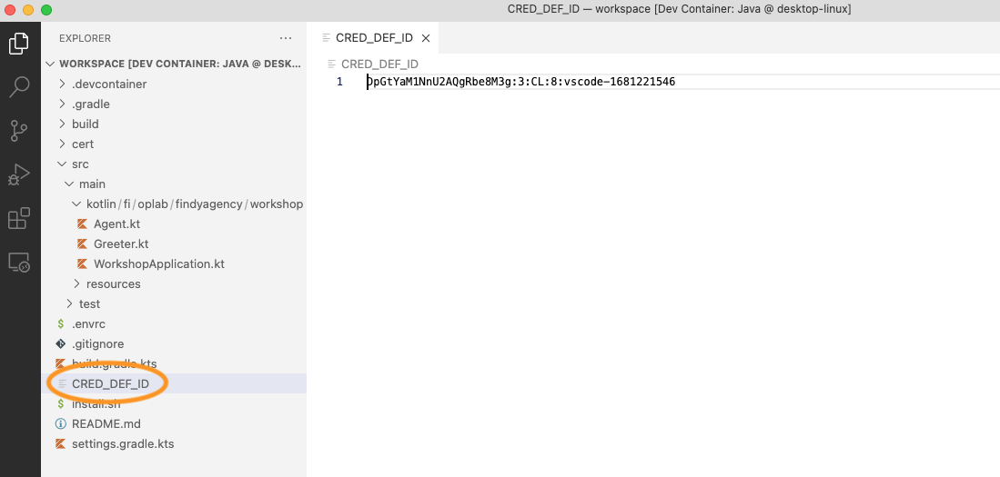

# Track 2.1 - Task 3: Prepare for issuing credentials

## Progress

* [Task 0: Setup environment](../README.md#task-0-setup-environment)
* [Task 1: Create a new connection](../task1/README.md#track-21---task-1-create-a-new-connection)
* [Task 2: Send greetings](../task2/README.md#track-21---task-2-send-greetings)
* **Task 3: Prepare for issuing credentials**
* [Task 4: Issue credential](../task4/README.md#track-21---task-4-issue-credential)
* [Task 5: Verify credential](../task5/README.md#track-21---task-5-verify-credential)
* [Task 6: Issue credential for verified information](../task6/README.md#track-21---task-6-issue-credential-for-verified-information)
* [Task 7: Additional tasks](../task7/README.md#track-21---task-7-additional-tasks)

## Description

In the previous task, we learned how to start Hyperledger Aries protocol interactions and
react to the protocol notifications utilizing the Findy Agency agent API. In the following
tasks, we will learn how to issue and verify credentials using similar APIs.

But before issuing credentials, we have to prepare our agent for it.
It means that we must have a suitable schema and credential definition available.

A schema describes the contents of the verifiable credential: which data attributes it
contains. The credential definition is like a public key published against that schema.
Other parties can verify the credential's validity against the credential definition and
ensure that your and only your agent has issued the credential.

## 1. Add code for creating credential definition

The creation of the credential definition is only needed then when we start
to issue new types of credentials. So we don't need to do it too often.

Open file `Agent.kt`.

Add new function `createCredentialDefinition` to class `Agent`:

```kotlin
  private fun createCredentialDefinition(): String = kotlinx.coroutines.runBlocking {
    var credDefId = ""
    try {
      credDefId = java.io.File("CRED_DEF_ID").readLines()[0]
    } catch (e: Exception) {}

    // Create cred def only if it does not exist already
    if (credDefId == "") {
      // Note: if schema creation fails, you have probably created
      // the same schema already with the same name and version number.
      // If this happens, change the version number and retry the creation
      val schemaRes =
          connection.agentClient.createSchema(
              name = "foobar",
              attributes = listOf("foo"),
              version = "1.0"
          )
      do {
        var schemaCreated = false
        try {
          val schema = connection.agentClient.getSchema(id = schemaRes.id)
          println("Created schema ${schema.id}")
          schemaCreated = true
        } catch (e: Exception) {
          println("Waiting for the schema to be created...")
          Thread.sleep(1_000 * 1)
        }
      } while (!schemaCreated)

      println("Starting to create credential definition (may take a while)...")
      val credDef = connection.agentClient.createCredDef(
        schemaId = schemaRes.id,
        tag = System.getenv("FCLI_USER")
      )
      credDefId = credDef.id
      java.io.File("CRED_DEF_ID").writeText(credDefId)
      println("Cred def ${credDefId} created successfully!")
    }
    credDefId
  }

```

## 2. Create credential definition on `Agent` creation

Continue editing file `Agent.kt`.

Add call to `createCredentialDefinition` function to `Agent` initialization:

```kotlin
class Agent {
  ...

  public val credDefId = createCredentialDefinition()

  ...
}
```

## 3. Ensure the credential definition is created from logs

Restart server and check logs.

Note! It will take a while for the agency to create a new credential definition.
Wait patiently.


## 4. Check `CRED_DEF_ID`-file

When the credential definition is created, the logic in your server code will store
the credential definition id in a text file  `CRED_DEF_ID` in the workspace root. If this file exists,
the creation of the credential definition is skipped on server start.



By default, the logic will create a schema `foobar` with one attribute `foo`. If you wish to change either
the schema name, the schema attributes or the tag of the credential definition, you need to delete
the `CRED_DEF_ID` file from the workspace root (so that the credential definition gets recreated).

For now, you can use the default values and proceed to the next tasks with the current credential
definition.

## 5. Continue with task 4

Congratulations, you have completed task 3, and you now know how to prepare your agent
to issue credentials!

You can now continue with [task 4](../task4/README.md).
