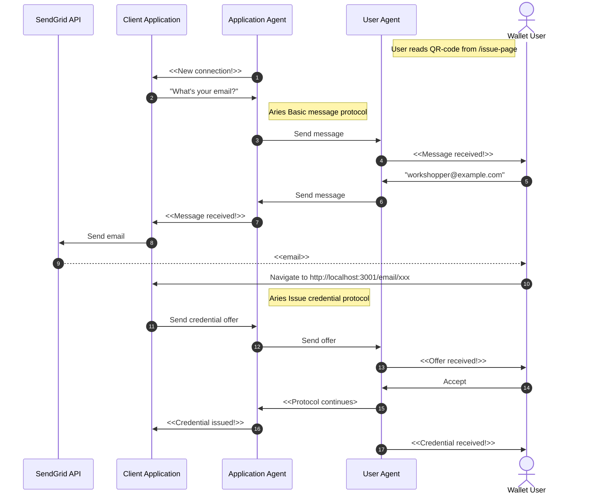
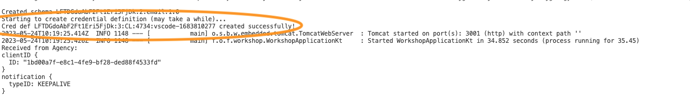
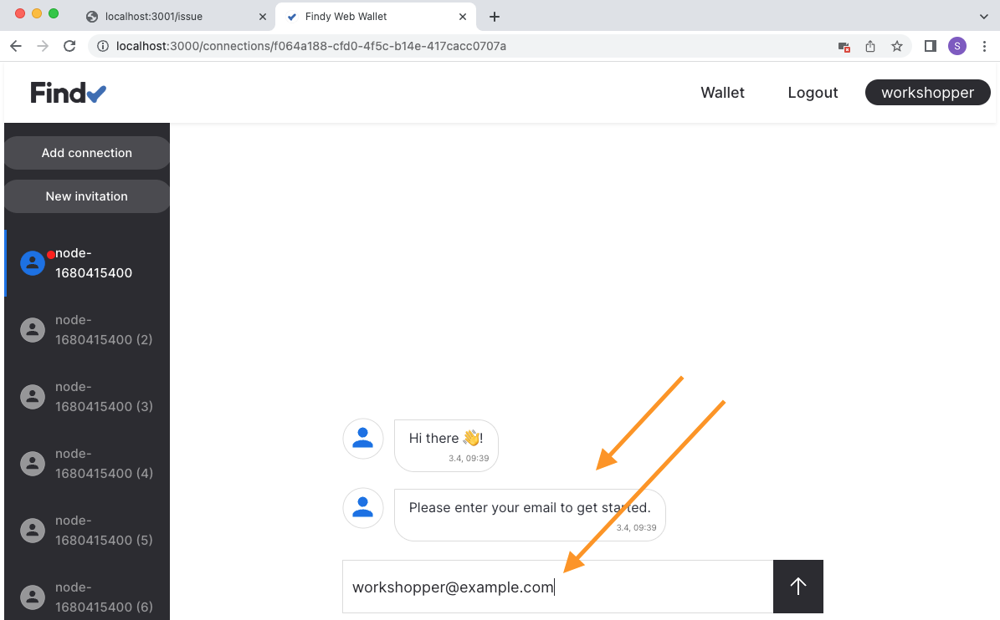
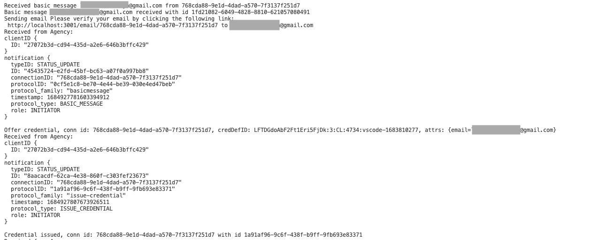

# Track 2.2 - Task 6: Issue credential for verified information

## Progress

* [Task 0: Setup environment](../README.md#task-0-setup-environment)
* [Task 1: Create a new connection](../task1/README.md#track-23---task-1-create-a-new-connection)
* [Task 2: Send greetings](../task2/README.md#track-23---task-2-send-greetings)
* [Task 3: Prepare for issuing credentials](../task3/README.md#track-23---task-3-prepare-for-issuing-credentials)
* [Task 4: Issue credential](../task4/README.md#track-23---task-4-issue-credential)
* [Task 5: Verify credential](../task5/README.md#track-23---task-5-verify-credential)
* **Task 6: Issue credential for verified information**
* [Task 7: Additional tasks](../task7/README.md#track-23---task-7-additional-tasks)

## Description

In our previous issuing example, we issued a `foobar` credential to anyone who connects with us.
However, this is not a likely real-world scenario. Probably the issuer wishes to issue some
meaningful data that it knows to be valid.

Let's change our issuer so that it issues credentials for a verified email. The issuer displays
a QR code as before, but when the connection is established, it will ask for the user's email address.
It sends an email with a verification URL to this address. Only when a user opens the verification URL
issuer will send the credential offer.

We must create a new schema and credential definition to issue email credentials. We also
need to create logic for asking for the email address. In addition, a new endpoint needs to be added
for the verification URL.

In this task, we will utilize SendGrid API for sending emails. You need an API key
to access the SendGrid API. You will be provided one in the guided workshop.

<details>
<summary>🤠 Acquire SendGrid API key</summary></br>

Create a free account to SendGrid and acquire the API key:
<https://sendgrid.com/solutions/email-api/>

Configure and verify also a sender identity for your email address.

</details></br>

### Task sequence


In this task:

We will create a new connection according to [the steps in task 1](../task1/README.md#task-sequence)
when the user reads the QR code in `/issue`-endpoint.
We have already the most of the logic for that in place.
In addition, we will add logic to the application to first verify user's email before issuing credential:

1. Once the connection protocol is complete, the application is notified of the new connection.
1. Application sends a basic message asking for the user's email address to the new connection.
1. Application agent initiates the **Aries basic message protocol**.
1. Wallet user gets a notification of the message.
1. Wallet user replies with their email address.
1. User agent initiates the **Aries basic message protocol**.
1. Application gets a notification of the message.
1. Application uses SendGrid API to send a verification email to the provided address.
1. SendGrid handles the email sending.
1. User receives the email and navigates to the provided URL.
1. Application sends a credential offer to the wallet user.
1. Application agent initiates the **Aries issue credential protocol**.
1. Wallet user gets a notification of the offer.
1. Wallet user accepts the offer.
1. Issue credential protocol continues.
1. Once the protocol is completed, the application is notified of the issuing success.
1. Once the protocol is completed, the wallet user is notified of the received credential.



## 1. Install SendGrid dependency

Open file `build.gradle.kts`.

Add a new dependency to your project:

```kotlin
dependencies {
    // add library for sending emails
    implementation("com.sendgrid:sendgrid-java:4.9.3")

    ...
}
```

## 2. Export environment variables for SendGrid API access

Open file `.envrc`. Add two new environment variables there:

```bash
export SENDGRID_API_KEY='<this_value_will_be_provided_for_you_in_the_workshop>'
export SENDGRID_SENDER='<this_value_will_be_provided_for_you_in_the_workshop>'
```

Save the file and type `direnv allow`.

<details>
<summary>🤠 Configure your own SendGrid account</summary></br>

Create API key with SendGrid UI and replace the value to `SENDGRID_API_KEY` variable.
Configure the verified sender email to `SENDGRID_SENDER` variable.

</details></br>

## 3. Create new credential definition

In [task 3](../task3/README.md), we created a schema and credential definition for `foobar`-credentials.
Now we need another schema and credential definition for our email credential.

Let's modify our code for creating the schema and the credential definition.

Open file `Agent.kt`.

Modify function `createCredentialDefinition`. Change the `name` to `"email"` and attributes list to `listOf("email")`:

```kotlin
      val schemaRes =
          connection.agentClient.createSchema(
              name = "email",
              attributes = listOf("email"),
              version = "1.0"
          )
```

Then delete (or rename) file `CRED_DEF_ID` from the workspace root.
This ensures that the schema and credential definition creation code is executed on server startup,
as there is no cached credential definition id.

```bash
mv CRED_DEF_ID foobar_CRED_DEF_ID
```

Restart your server `gradle bootRun`.

## 4. Ensure credential definition for email schema is created

Note! It will take a while for the agency to create a new credential definition.
Wait patiently.



## 5. Modify issuer for email changes

Open file `Issuer.kt`.

Add following rows to imports:

```kotlin
import com.sendgrid.*;
import com.sendgrid.helpers.mail.*;
import com.sendgrid.helpers.mail.objects.*;
```

Add new fields to `email` and `verified` to `Pairwise`-class:

```kotlin
class Pairwise(id: String) {
  val id: String = id
  var email: String? = null
  var verified: Boolean = false
}
```

Modify class `Issuer`. Add new member `sgClient` for the SendGrid API connection
and initialize it in the constructor:

```kotlin
  val sgClient: SendGrid

  init {
    sgClient = SendGrid(System.getenv("SENDGRID_API_KEY"));
  }
```

Add new utility functions `askForEmail` and `sendEmail`
to class `Issuer` for sending messages:

```kotlin
  private suspend fun askForEmail(connectionId: String) {
    // Ask for user email via basic message
    connection.protocolClient.sendMessage(
      connectionId,
      "Please enter your email to get started."
    )
  }

  // Send email via SendGrid API
  private suspend fun sendEmail(email: String, content: String) {
    val mail = Mail(
      Email(System.getenv("SENDGRID_SENDER")),
      "Email verification",
      Email(email),
      Content("text/plain", content)
    )

    println("Sending email ${content} to ${email}")

    val request = Request()
    request.setMethod(Method.POST)
    request.setEndpoint("mail/send")
    request.setBody(mail.build())
    sgClient.api(request)
  }
```

Instead of issuing the credential when a new connection is established,
we want to ask the user for their email and send the credential offer
only after verifying their email. So when a new connection is established,
we send a basic message asking for the email.
Replace the contents of `handleNewConnection` with following:

```kotlin
  override suspend fun handleNewConnection(
    notification: Notification,
    status: ProtocolStatus.DIDExchangeStatus
  ) {
    val pwConnection = pwConnections.get(notification.connectionID)
    if (pwConnection == null) {
      // Connection was not for issuing, skip
      return
    }

    if (pwConnection.email == null) {
      askForEmail(notification.connectionID)
    }
  }
```

Add new function `handleBasicMessageDone` to class `Issuer`. This function will handle
the basic messages the user
is sending from the other end. If the user replies with an email address, a verification email is sent
to the provided address.

```kotlin
  override suspend fun handleBasicMessageDone(
    notification: Notification,
    status: ProtocolStatus.BasicMessageStatus
  ) {
    // Skip handling if message was sent by us or
    // the verification is already done
    val pwConnection = pwConnections.get(notification.connectionID)
    if (status.getSentByMe() || pwConnection == null || pwConnection.email != null) {
      return
    }

    println("Basic message ${status.getContent()} received with id ${notification.protocolID}")

    // Some sanity checking
    val email = status.getContent()
    val emailValid = email.split(' ').size == 1 && email.indexOf('@') >= 0

    if (emailValid) {
      // Valid email, do verification
      pwConnection.email = email

      val content = "Please verify your email by clicking the following link:\n http://localhost:3001/email/${pwConnection.id}"
      // Send verification mail
      sendEmail(pwConnection.email!!, content)

      // Send confirmation via basic message
      connection.protocolClient.sendMessage(
        pwConnection.id,
        "Email is on it's way! Please check your mailbox 📫."
      )
    } else {
      // Email invalid, ask again
      askForEmail(pwConnection.id)
    }
  }
```

Add new function `setEmailVerified`. This function will send a credential offer
of a verified email when the user has clicked the verification link.

```kotlin
  suspend fun setEmailVerified(connectionId: String): Boolean {
    // Skip handling if the verification is already done
    val pwConnection = pwConnections.get(connectionId)
    if (pwConnection == null || pwConnection.email == null || pwConnection.verified) {
      return false
    }

    pwConnection.verified = true

    val attrs = mapOf("email" to pwConnection.email!!)

    println("Offer credential, conn id: ${connectionId}, credDefID: ${credDefId}, attrs: ${attrs}")

    // Send credential offer to the other agent
    connection.protocolClient.sendCredentialOffer(
      pwConnection.id,
      attrs,
      credDefId
    )
    return true
  }
```

## 6. Add endpoint for email verification

Open file `WorkshopApplication.kt`.

Add a new endpoint that handles email URL clicks.
The function asks the issuer to send a credential offer if the connection is valid and found.

```kotlin
  @GetMapping("/email/{connectionId}") fun issueEmail(@PathVariable("connectionId") id: String): String {
    var res = "<html><h1>Error</h1></html>"
    runBlocking {
      if (issuer.setEmailVerified(id)) {
        res = """<html>
<h1>Offer sent!</h1>
<p>Please open your wallet application and accept the credential.</p>
<p>You can close this window.</p></html>"""
      }
    }
    return res
  }
```

## 7. Testing

Now you should have the needed bits and pieces in place. Let's test if it works.

Navigate to page <http://localhost:3001/issue> and
create a new pairwise connection to your web wallet user.
The app should ask you for your email. Input a valid email address that you have access to.



The application sends the verification email and basic message telling the user to check their inbox.


Check your inbox and navigate to the verification link with your desktop browser.


Check the web wallet view and accept the credential offer.


Review server logs.



## 8. Continue with task 7

Congratulations, you have completed task 6 and now know a little more about
how to build the application logic for issuers!
To revisit what happened, check [the sequence diagram](#task-sequence).

You can now continue with [task 7](../task7/README.md).
